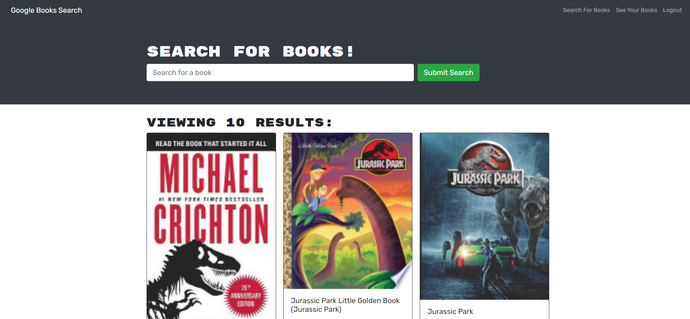

# Book Search Engine

## Description

An App to search and save all your favourite books!

## Table of Contents

- [Installation](#installation)
- [Usage](#usage)
- [License](#license)
- [Questions](#questions)

## Installation

- To install, click the green code button. Download the zip file and unpack. Open in your favourite code editor.
- Open terminal in the root
- In the terminal run "npm i"
- In the terminal run "npm run build"
- In the terminal run "npm run developer"

## Usage

[DEMO APP](https://booksearch-brandon.herokuapp.com/)

## License

[APACHE](https://www.apache.org/licenses/LICENSE-2.0.txt)

## Questions

[GitHub Profile](https://github.com/bdubz93).

Questions? You can email me at brandonwinkler@live.ca.
